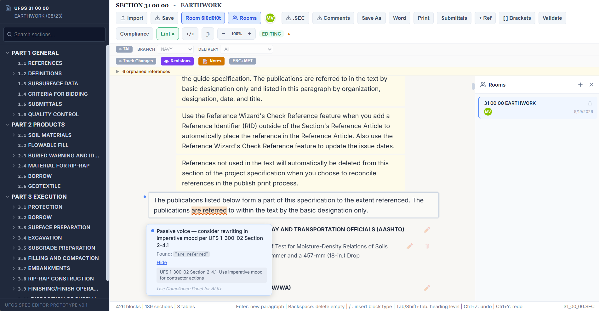
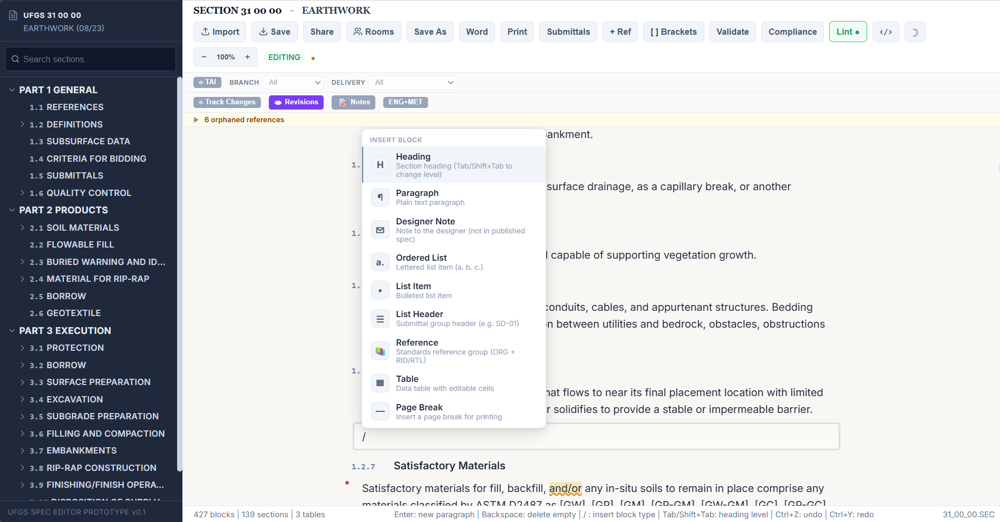
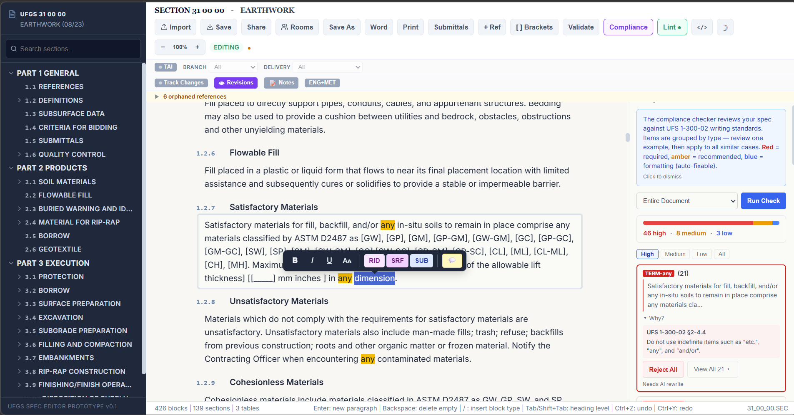
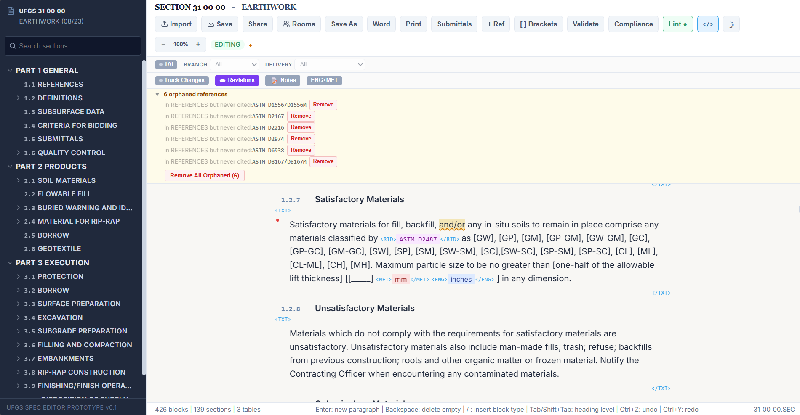
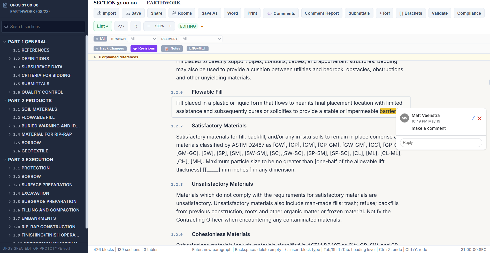

<p align="center">
  <picture>
    <source media="(prefers-color-scheme: dark)" srcset="src/assets/brand/logo-full-dark.svg">
    
  </picture>
</p>

# SecWriter

*A real-time collaborative web editor for UFGS (Unified Facilities Guide Specifications) `.SEC` files — the XML-based format used by SpecsIntact.*

> SecWriter is an independent project. It is not affiliated with the U.S. Department of Defense, USACE, NAVFAC, NASA, or the authors of UFGS or SpecsIntact. See [Acknowledgments & disclaimer](#acknowledgments--disclaimer) below.

> NOTICE: this is the only human-written sentence in this readme file; I am not a software engineer, ALL of the code for this project is produced by Claude Code.



## Try it

**[secwriter-frontend.onrender.com](https://secwriter-frontend.onrender.com)**

> The hosted demo is a free-tier deployment with no SLA. Rooms may be wiped without notice — **do not store production specs here**. The first request after idle takes ~30 seconds to cold-start. For anything real, run SecWriter locally (see below).

## What it does

SecWriter reads, edits, and writes `.SEC` files directly in the browser, with **real-time multi-user editing** built in: multiple engineers can work on the same `.SEC` section simultaneously, seeing each other's cursors, edits, comments, and track-change marks live. Edits merge without conflicts and reconcile cleanly after a client loses or regains its network connection.

Engineers write prose, tables, references, and submittals inside the same XML-based format SpecsIntact uses — without leaving the editor to convert through Word and without learning a tag-based UI.

## Why it exists

Today, most engineers writing UFGS specifications choose between two tools, neither of which is ideal for the day-to-day work:

- **SpecsIntact** is the established tool. It produces correct `.SEC` files and integrates with USACE/NAVFAC reference databases, but its tag-based section editor (SIEditor) has a steep learning curve, the editing UX lags well behind modern word processors, and it is a single-user desktop application — two engineers cannot meaningfully edit the same section at the same time.
- **Microsoft Word** has the editing experience engineers know — real-time collaboration, comments, track changes, decent tables — but it does not produce `.SEC`. Round-tripping Word content back into SpecsIntact loses formatting fidelity and is error-prone.

SecWriter combines the two halves people actually want — and adds the one neither tool delivers on `.SEC` files: **real-time multi-user editing**. The editing experience of Word, the format fidelity of SpecsIntact, and live collaboration on the `.SEC` file itself. Slash commands for block types, multiple cursors, threaded comments, and track changes — all operating directly on `.SEC` files, in the browser, with no per-seat desktop install.

### Scope

SecWriter replaces **SIEditor** — the section editor inside SpecsIntact — for engineers who spend most of their time writing prose, tables, and references inside individual `.SEC` sections. It does **not** replace SpecsIntact as a whole: the SpecsIntact desktop application also handles project setup, spec-book assembly, template management, reference master lists, and publishing workflows that SecWriter does not provide. A team using SecWriter typically still depends on SpecsIntact for everything around the section.

## Features

1. **The editing experience of Word, the format fidelity of SpecsIntact.** Slash commands for block types, threaded comments, and track changes — all operating directly on `.SEC` files. No Word-to-SpecsIntact round-trip; no learning curve for tag-based editing.
   
2. **Real-time multi-user editing on `.SEC` files.** The capability no other `.SEC` editor offers. Built on Yjs CRDTs (with Hocuspocus and `y-prosemirror`), so multiple engineers work on the same section simultaneously — live cursors, presence awareness, threaded comments visible to all participants, and track-change marks attributed per author. Edits merge without conflicts and reconcile cleanly after a client drops and reconnects. Works across the public internet through the included collab server, or fully on a private network if you self-host.
3. **UFS 1-300-02 compliance checking** with grouped findings and one-click auto-fixes for the rules that have deterministic corrections. Rules are data-driven (`src/data/ufs-1-300-02-rules.json`) and traceable to specific sections of the UFS 1-300-02 standard.
   
4. **Tag-aware editing without tags.** A slash menu picks block types (paragraphs, items, lists, notes, tables, references). The SGML structure is inferred from context, not selected from a toolbar. A `</>` button toggles tag visibility for when you do want to see the underlying structure.
   
5. **Track Changes and inline Comments** with per-author attribution and color coding — across multiple simultaneous editors. Accept/reject works at the inline-mark grain or document-wide.
   
6. **Reference Wizard** backed by the Unified Master Reference List (UMRL) — search by organization or designation, insert formatted references into the SEC file.

Also included: inline grammar and style linting (Harper.js + compromise.js), three storage backends (local disk / Azure Blob / S3-compatible), strict windows-1252 round-trip fidelity, and aggressive browser-side privacy defaults (Grammarly/Copilot exfiltration disabled, no telemetry).

## Run it locally

### Prerequisites

- Node.js 20 or newer
- Git
- Windows users: Git Bash is recommended for parity with the development environment

### Quick start

```bash
git clone https://github.com/mttvnst-HA/secwriter.git
cd secwriter
npm install
npm run dev
```

The Vite dev server starts at <http://localhost:5173>. You can edit `.SEC` files without the collab server — single-user, local-only mode works out of the box.

### Multi-user editing (optional)

Open a second terminal and start the collab server:

```bash
npm run collab
```

The collab server listens on `127.0.0.1:1234` and serves both the WebSocket relay and the HTTP API for `.SEC` import/export and room listing. With the default `SIM_STORAGE_BACKEND=local`, rooms persist to `server/collab-db/` on disk.

### Local development vs the hosted demo

The hosted demo at <https://secwriter-frontend.onrender.com> is **not** a production deployment. It runs on Render's free tier with relaxed CORS (`*`), authentication disabled, and Cloudflare R2 for storage. The render.yaml itself describes it as a "dev/test environment." The free tier cold-starts after 15 minutes of inactivity (~30 s delay on first request) and offers no SLA.

If you want to host SecWriter for real use — a team, a sponsor, anything beyond casual evaluation — expand the "Self-hosting for production" section below for the hardening checklist.

<details>
<summary><strong>Environment variables</strong></summary>

Copy `.env.example` to `.env.local` and edit. Common variables:

| Variable | Default | Notes |
|---|---|---|
| `SIM_STORAGE_BACKEND` | `local` | `local`, `azure`, or `s3` |
| `SIM_LOCAL_STORAGE_DIR` | `server/collab-db/` | Local backend storage directory |
| `SIM_S3_ENDPOINT` | — | S3-compatible endpoint (Cloudflare R2, AWS S3, MinIO) |
| `SIM_S3_REGION` | — | `auto` for R2; the AWS region for S3 |
| `SIM_S3_ACCESS_KEY_ID` | — | |
| `SIM_S3_SECRET_ACCESS_KEY` | — | |
| `SIM_S3_BUCKET` | — | |
| `SIM_AZURE_STORAGE_CONNECTION_STRING` | — | Azure Blob (alternative to URL+identity) |
| `SIM_AZURE_STORAGE_ACCOUNT_URL` | — | For Azure managed identity auth |
| `SIM_AZURE_STORAGE_CONTAINER` | `sim-collab-rooms` | |
| `SIM_AUTH_PROVIDER` | `none` | `none` or `jwt` |
| `SIM_AUTH_JWT_SECRET` | — | Required when `SIM_AUTH_PROVIDER=jwt` |
| `SIM_AUTH_JWT_ISSUER` | — | Expected token issuer |
| `SIM_AUTH_JWT_AUDIENCE` | — | Expected token audience |
| `SIM_COLLAB_ORIGIN` | `*` | CORS allowed origin |
| `VITE_COLLAB_WS_URL` | `ws://127.0.0.1:1234/` | Client-side collab WebSocket URL |
| `VITE_COLLAB_HTTP_URL` | `http://127.0.0.1:1234` | Client-side collab HTTP base URL |

Frontend (`VITE_*`) variables must be set at build time — they are inlined into the JS bundle by Vite.

</details>

<details>
<summary><strong>Running the test suites</strong></summary>

```bash
npm test                   # Vitest unit tests
npm run test:compliance    # Compliance rules (Node test runner)
npm run test:corpus        # Corpus precision/recall/calibration/adversarial
npm run test:server        # Collab server integration tests
npm run test:ufgs          # UFGS tag coverage across 690 master specs
npm run test:interop       # Parse/serialize/roundtrip
npm run test:e2e           # Playwright end-to-end suite
```

First-time E2E setup requires browser binaries: `npx playwright install`.

See [CLAUDE.md](CLAUDE.md) for the test-development conventions (test-size limits, the Node-vs-Vitest split for the compliance engine, and known E2E flakes).

</details>

<details>
<summary><strong>Self-hosting for production</strong></summary>

The included [`render.yaml`](render.yaml) is a starting point for a Render deployment but is configured for a permissive dev/test environment. A real production deployment should at minimum:

- **Tighten CORS.** Set `SIM_COLLAB_ORIGIN` to the exact frontend origin, not `*`.
- **Enable authentication.** Set `SIM_AUTH_PROVIDER=jwt` and supply `SIM_AUTH_JWT_SECRET` / `SIM_AUTH_JWT_ISSUER` / `SIM_AUTH_JWT_AUDIENCE`. Without auth, anyone with the server URL can join any room.
- **Use a persistent storage backend.** Either Azure Blob (`azure`) or an S3-compatible backend (`s3`) — `local` storage is wiped on container redeploys.
- **Plan for cold starts.** Render's free tier sleeps after idle; a paid plan or a different host is required if you need consistent latency.
- **Monitor `/health`.** The endpoint returns `status`, `uptime`, active room count, and any unhealthy rooms; wire it into your platform's health-check system.
- **Consider rate limiting.** The collab server enforces a per-IP rate limit via `SIM_RATE_LIMIT_*` env vars; raise or lower as needed.

This project does not currently ship a hardened production deployment recipe. Production-readiness is on you.

</details>

<details>
<summary><strong>Troubleshooting</strong></summary>

- **"Connecting to room..." forever.** No identity is set in `localStorage`. Fill the name prompt; the `HocuspocusProvider` only starts once an identity exists.
- **"WebSocket is closed before the connection is established" warning in dev.** Benign React.StrictMode artifact — effects mount, unmount, and re-mount in development to expose effect bugs. Production builds don't emit it. Verify with `window.__collab.provider.status === 'connected'`.
- **Storage backend not picking up env vars.** Restart the collab server after editing `.env.local`; environment variables are read once at startup.
- **Playwright tests fail with browser errors.** Run `npx playwright install` to fetch the matching browser binaries.

</details>

## Project status

Version 0.1, actively developed. The project ships substantial test coverage — approximately 1,800 tests across Vitest unit, Node-runner compliance and corpus, and server integration suites, plus a 183-test Playwright end-to-end suite — and `.SEC` file format compatibility is regression-tested against all 690 UFGS master specifications.

That said: **pre-1.0 means no API stability guarantee yet**, and the hosted demo is a free-tier deployment with no SLA. **Export your work**; do not trust the demo with anything you cannot afford to lose. The `.SEC` file format compatibility itself is the load-bearing contract and is the part most actively defended by tests.

## Architecture & contributing

**Stack at a glance:**

- React 19 + Vite (frontend)
- ProseMirror (editor substrate, per-block `EditorView`)
- Yjs + Hocuspocus + y-prosemirror (CRDT collaboration)
- Node.js CJS collab server
- Pluggable storage: local disk, Azure Blob, S3-compatible (Cloudflare R2, AWS S3, MinIO)
- Harper.js (grammar) + compromise.js (NLP) for inline linting
- Vitest, Node test runner, Playwright (test stack)

**Deep documentation:**

- [`CLAUDE.md`](CLAUDE.md) — project guide for agents and contributors: orientation, architecture invariants, known pitfalls, testing rules
- [`CONTEXT.md`](CONTEXT.md) — domain glossary (block, transparent tag, publish path, etc.)
- [`docs/adr/`](docs/adr/) — architectural decision records for load-bearing choices (CJS server, y-websocket pin, rules-as-data, snapshot-diff publish path, storage atomicity)

**Contributing:** Issues welcome. PRs by invitation only — please file an issue first and wait for a response before opening a pull request.

## License

PolyForm Noncommercial License 1.0.0 — see [`LICENSE.md`](LICENSE.md). Free for personal use, noncommercial organizations (charitable, educational, public research, government), and noncommercial purposes generally. Commercial use requires a separate license.

## Acknowledgments & disclaimer

**UFGS** (Unified Facilities Guide Specifications) and **SpecsIntact** are products of U.S. government agencies and their contractors. SecWriter is an independent project and is **not affiliated with, endorsed by, or sponsored by** the U.S. Department of Defense, the U.S. Army Corps of Engineers, the Naval Facilities Engineering Systems Command, NASA, or any other agency or vendor associated with UFGS or SpecsIntact. UFGS and SpecsIntact are referenced by name solely to identify the file format and editing workflow this project addresses. No trademark claim is made.

SecWriter is built on excellent open-source work — notably ProseMirror, Yjs (with Hocuspocus and y-prosemirror), Harper.js, compromise.js, and React. See [`package.json`](package.json) for the full dependency list and respective licenses.
